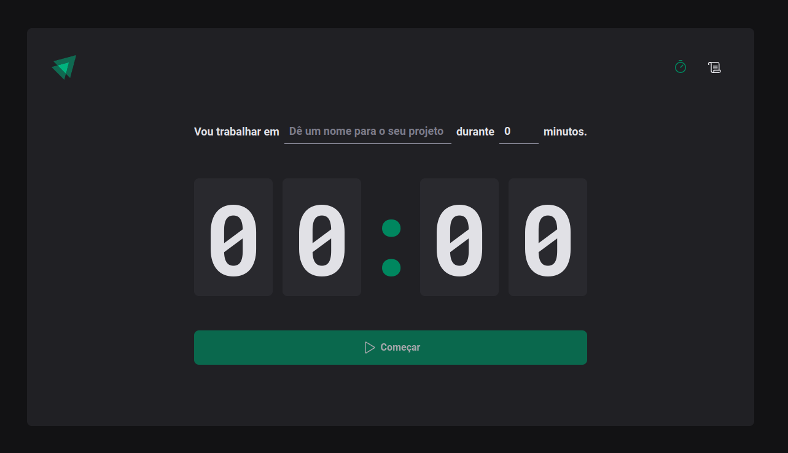
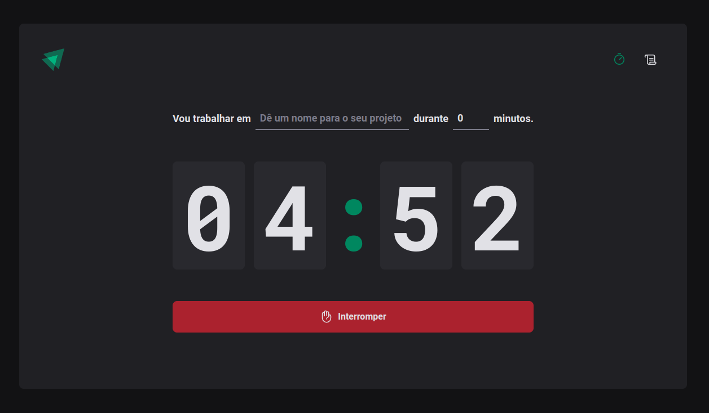
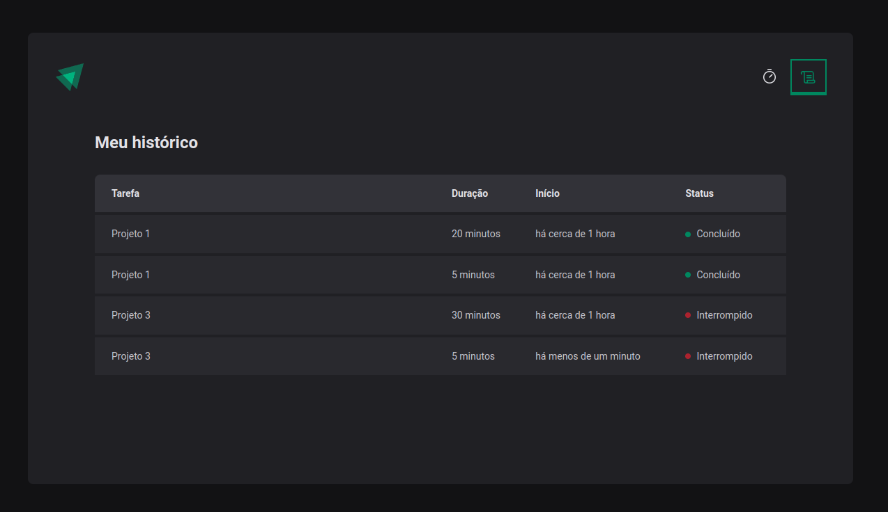

# Ignite Timer

Aplicação Timer, para marcar tempo de realização tarefas, em ReactJS usando o framework Vitejs, da Jornada do Ignite Rocketseat, instrutor Diego Fernandes:

### # tecnologias usadas:

- typescript
- phosphor-react
- date-fns
- style-components
- immer
- react-hook-form
- react-router-dom
- zod

---

## Screenshot

  
  
  

---

💜 Ignite Trilha ReactJS 2022
